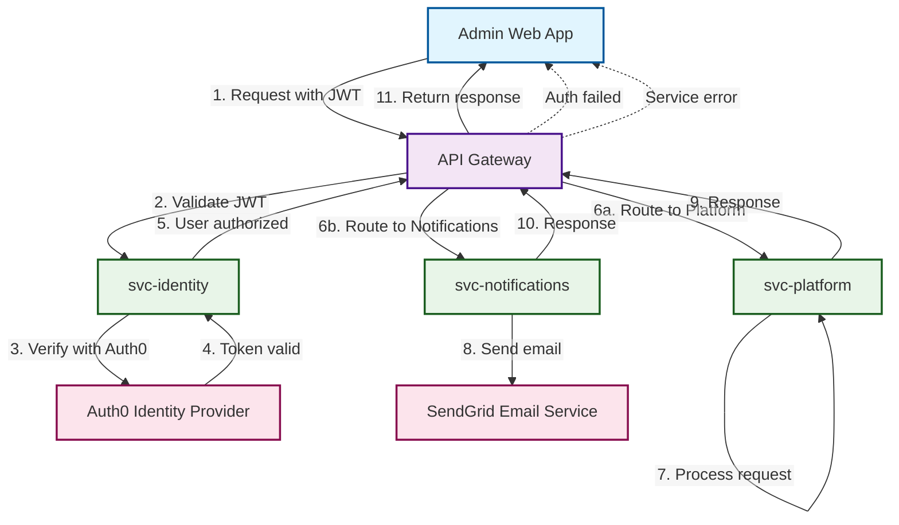

# API Gateway

## Overview

The API Gateway serves as the central entry point for all client applications, handling routing, authentication, and request/response processing.

## Responsibilities

### Authentication & Authorization

- JWT token verification via `svc-identity`
- Rate limiting and throttling
- CORS handling

### Routing

- Route requests to appropriate microservices
- Request/response transformation
- API versioning

## Architecture

## Implementation Details

- **Entry Point**: All applications use the API Gateway
- **Authentication**: JWT verification delegated to `svc-identity`
- **Routing**: Intelligent routing based on request patterns
- **Monitoring**: Request/response logging and metrics

## Security Features

- JWT token validation
- Request rate limiting
- CORS configuration

## Performance Considerations

- Response caching where appropriate
- Timeout handling

## Technology Options

- **NestJS**: Consistent with backend services
- **GCP API Gateway**: Enterprise API gateway
