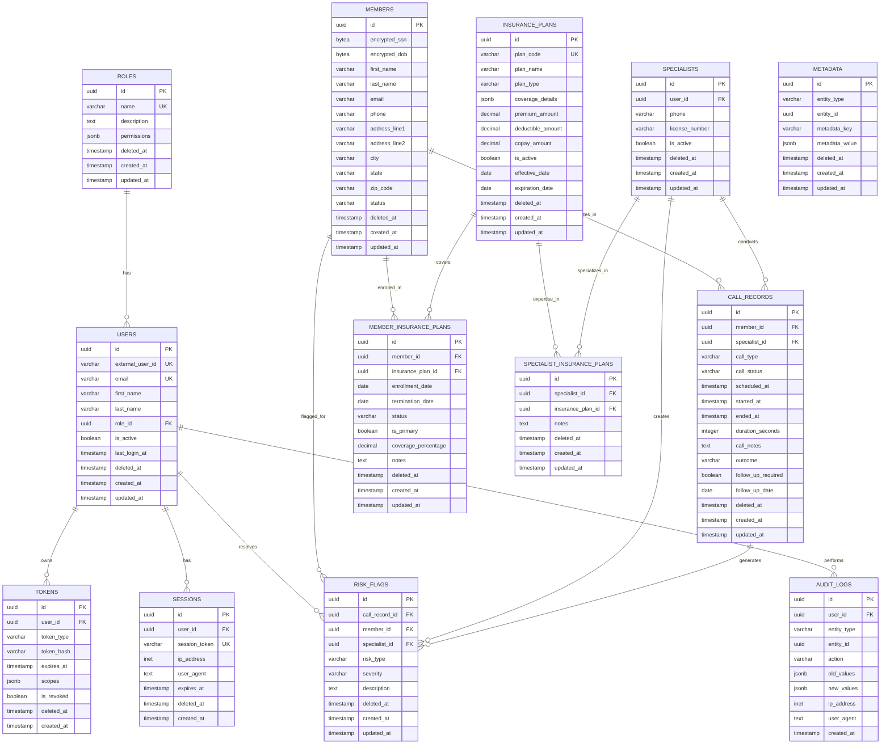

# Datastores

## Overview

Each microservice maintains its own PostgreSQL database following the database-per-service pattern.

## Database Architecture

### Service Databases

#### svc-identity Database

- **Purpose**: User authentication data, tokens, sessions

#### svc-platform Database

- **Purpose**: Business domain data

## Database Schemas

### Schema Overview



### svc-identity Schema

#### users

```sql
CREATE TABLE users (
  id UUID PRIMARY KEY DEFAULT gen_random_uuid(),
  external_user_id VARCHAR(255) UNIQUE NOT NULL, -- Auth0 user ID
  email VARCHAR(255) UNIQUE NOT NULL,
  first_name VARCHAR(100),
  last_name VARCHAR(100),
  role_id UUID REFERENCES roles(id),
  is_active BOOLEAN DEFAULT true,
  last_login_at TIMESTAMP,
  deleted_at TIMESTAMP,
  created_at TIMESTAMP DEFAULT NOW(),
  updated_at TIMESTAMP DEFAULT NOW()
);
```

#### roles

```sql
CREATE TABLE roles (
  id UUID PRIMARY KEY DEFAULT gen_random_uuid(),
  name VARCHAR(50) UNIQUE NOT NULL,
  description TEXT,
  permissions JSONB,
  deleted_at TIMESTAMP,
  created_at TIMESTAMP DEFAULT NOW(),
  updated_at TIMESTAMP DEFAULT NOW()
);
```

#### tokens

```sql
CREATE TABLE tokens (
  id UUID PRIMARY KEY DEFAULT gen_random_uuid(),
  user_id UUID REFERENCES users(id),
  token_type VARCHAR(20) NOT NULL, -- 'access', 'refresh', 'api'
  token_hash VARCHAR(255) NOT NULL,
  expires_at TIMESTAMP NOT NULL,
  scopes JSONB,
  is_revoked BOOLEAN DEFAULT false,
  deleted_at TIMESTAMP,
  created_at TIMESTAMP DEFAULT NOW()
);
```

#### sessions

```sql
CREATE TABLE sessions (
  id UUID PRIMARY KEY DEFAULT gen_random_uuid(),
  user_id UUID REFERENCES users(id),
  session_token VARCHAR(255) UNIQUE NOT NULL,
  ip_address INET,
  user_agent TEXT,
  expires_at TIMESTAMP NOT NULL,
  deleted_at TIMESTAMP,
  created_at TIMESTAMP DEFAULT NOW()
);
```

### svc-platform Schema

#### members

```sql
CREATE TABLE members (
  id UUID PRIMARY KEY DEFAULT gen_random_uuid(),
  encrypted_ssn BYTEA, -- Encrypted SSN
  encrypted_dob BYTEA, -- Encrypted date of birth
  first_name VARCHAR(100) NOT NULL,
  last_name VARCHAR(100) NOT NULL,
  email VARCHAR(255),
  phone VARCHAR(20),
  address_line1 VARCHAR(255),
  address_line2 VARCHAR(255),
  city VARCHAR(100),
  state VARCHAR(2),
  zip_code VARCHAR(10),
  status VARCHAR(20) DEFAULT 'active', -- 'active', 'inactive', 'suspended'
  deleted_at TIMESTAMP,
  created_at TIMESTAMP DEFAULT NOW(),
  updated_at TIMESTAMP DEFAULT NOW()
);
```

#### specialists

```sql
CREATE TABLE specialists (
  id UUID PRIMARY KEY DEFAULT gen_random_uuid(),
  user_id UUID REFERENCES users(id),
  phone VARCHAR(20),
  license_number VARCHAR(50),
  is_active BOOLEAN DEFAULT true,
  deleted_at TIMESTAMP,
  created_at TIMESTAMP DEFAULT NOW(),
  updated_at TIMESTAMP DEFAULT NOW()
);
```

#### call_records

```sql
CREATE TABLE call_records (
  id UUID PRIMARY KEY DEFAULT gen_random_uuid(),
  member_id UUID REFERENCES members(id),
  specialist_id UUID REFERENCES specialists(id),
  call_type VARCHAR(20) NOT NULL, -- 'outreach', 'follow_up', 'support'
  call_status VARCHAR(20) NOT NULL, -- 'scheduled', 'completed', 'cancelled', 'no_answer'
  scheduled_at TIMESTAMP,
  started_at TIMESTAMP,
  ended_at TIMESTAMP,
  duration_seconds INTEGER,
  call_notes TEXT,
  outcome VARCHAR(50), -- 'successful', 'rescheduled', 'declined', etc.
  follow_up_required BOOLEAN DEFAULT false,
  follow_up_date DATE,
  deleted_at TIMESTAMP,
  created_at TIMESTAMP DEFAULT NOW(),
  updated_at TIMESTAMP DEFAULT NOW()
);
```

#### insurance_plans

```sql
CREATE TABLE insurance_plans (
  id UUID PRIMARY KEY DEFAULT gen_random_uuid(),
  plan_code VARCHAR(50) UNIQUE NOT NULL,
  plan_name VARCHAR(255) NOT NULL,
  plan_type VARCHAR(50), -- 'HMO', 'PPO', 'EPO', etc.
  coverage_details JSONB,
  premium_amount DECIMAL(10,2),
  deductible_amount DECIMAL(10,2),
  copay_amount DECIMAL(10,2),
  is_active BOOLEAN DEFAULT true,
  effective_date DATE,
  expiration_date DATE,
  deleted_at TIMESTAMP,
  created_at TIMESTAMP DEFAULT NOW(),
  updated_at TIMESTAMP DEFAULT NOW()
);
```

#### member_insurance_plans

```sql
CREATE TABLE member_insurance_plans (
  id UUID PRIMARY KEY DEFAULT gen_random_uuid(),
  member_id UUID REFERENCES members(id) NOT NULL,
  insurance_plan_id UUID REFERENCES insurance_plans(id) NOT NULL,
  enrollment_date DATE NOT NULL,
  termination_date DATE,
  status VARCHAR(20) DEFAULT 'active', -- 'active', 'terminated', 'suspended'
  is_primary BOOLEAN DEFAULT false, -- Primary insurance plan
  coverage_percentage DECIMAL(5,2) DEFAULT 100.00, -- Coverage percentage
  notes TEXT,
  deleted_at TIMESTAMP,
  created_at TIMESTAMP DEFAULT NOW(),
  updated_at TIMESTAMP DEFAULT NOW(),
  UNIQUE(member_id, insurance_plan_id, enrollment_date)
);
```

#### specialist_insurance_plans

```sql
CREATE TABLE specialist_insurance_plans (
  id UUID PRIMARY KEY DEFAULT gen_random_uuid(),
  specialist_id UUID REFERENCES specialists(id) NOT NULL,
  insurance_plan_id UUID REFERENCES insurance_plans(id) NOT NULL,
  notes TEXT,
  deleted_at TIMESTAMP,
  created_at TIMESTAMP DEFAULT NOW(),
  updated_at TIMESTAMP DEFAULT NOW(),
  UNIQUE(specialist_id, insurance_plan_id)
);
```

#### metadata

```sql
CREATE TABLE metadata (
  id UUID PRIMARY KEY DEFAULT gen_random_uuid(),
  entity_type VARCHAR(50) NOT NULL, -- 'member', 'specialist', 'call_record', etc.
  entity_id UUID NOT NULL,
  metadata_key VARCHAR(100) NOT NULL,
  metadata_value JSONB,
  deleted_at TIMESTAMP,
  created_at TIMESTAMP DEFAULT NOW(),
  updated_at TIMESTAMP DEFAULT NOW(),
  UNIQUE(entity_type, entity_id, metadata_key)
);
```

#### risk_flags

```sql
CREATE TABLE risk_flags (
  id UUID PRIMARY KEY DEFAULT gen_random_uuid(),
  call_record_id UUID REFERENCES call_records(id) NOT NULL,
  member_id UUID REFERENCES members(id) NOT NULL,
  specialist_id UUID REFERENCES specialists(id) NOT NULL,
  risk_type VARCHAR(50) NOT NULL, -- 'medical', 'financial', 'compliance', 'safety', 'other'
  severity VARCHAR(20) NOT NULL, -- 'low', 'medium', 'high', 'critical'
  description TEXT NOT NULL,
  deleted_at TIMESTAMP,
  created_at TIMESTAMP DEFAULT NOW(),
  updated_at TIMESTAMP DEFAULT NOW()
);
```

#### audit_logs

```sql
CREATE TABLE audit_logs (
  id UUID PRIMARY KEY DEFAULT gen_random_uuid(),
  user_id UUID,
  entity_type VARCHAR(50) NOT NULL,
  entity_id UUID NOT NULL,
  action VARCHAR(50) NOT NULL, -- 'create', 'read', 'update', 'delete'
  old_values JSONB,
  new_values JSONB,
  ip_address INET,
  user_agent TEXT,
  created_at TIMESTAMP DEFAULT NOW()
);
```

## Technology Stack

### Database

- **Primary**: PostgreSQL
- **Version**: 13+ (recommended)
- **Features**: JSON support, full-text search, ACID compliance

### ORM & Migrations

- **ORM**: TypeORM
- **Benefits**:
  - TypeScript integration
  - Entity-based modeling
  - Migration management
  - Query builder

## Data Management

### Migrations

- Version-controlled database schema changes
- Automated migration execution in CI/CD
- Rollback capabilities for failed migrations

### Backup Strategy

- Automated daily backups
- Point-in-time recovery
- Cross-region backup replication

### Data Consistency

- Eventual consistency between services
- Event-driven updates for cross-service data
- Transaction boundaries within services

## Performance Considerations

### Indexing

- Strategic indexing on frequently queried columns
- Composite indexes for complex queries
- Regular index maintenance and optimization

### Connection Pooling

- Connection pool management
- Connection limits per service
- Connection health monitoring

### Scaling

- Read replicas for read-heavy workloads
- Horizontal partitioning for large tables
- Database sharding if needed

## Security

### Access Control

- Service-specific database users
- Principle of least privilege
- Encrypted connections (SSL/TLS)
- Multi-factor authentication for database access

### Data Protection

- **Encryption at Rest**: AES-256 encryption for all databases
- **PHI Encryption**: Additional encryption layer for Protected Health Information
- **Key Management**: Hardware Security Modules (HSMs) or cloud KMS
- **Audit Logging**: Comprehensive logging of all PHI access and modifications

### HIPAA Compliance

- **Data Classification**: Separate handling for PHI vs. non-PHI data
- **Access Logging**: All PHI access must be logged with user context
- **Data Minimization**: Store only necessary PHI data
- **Retention Policies**: Automatic deletion after HIPAA retention periods
- **Backup Encryption**: Encrypted backups with secure key management
