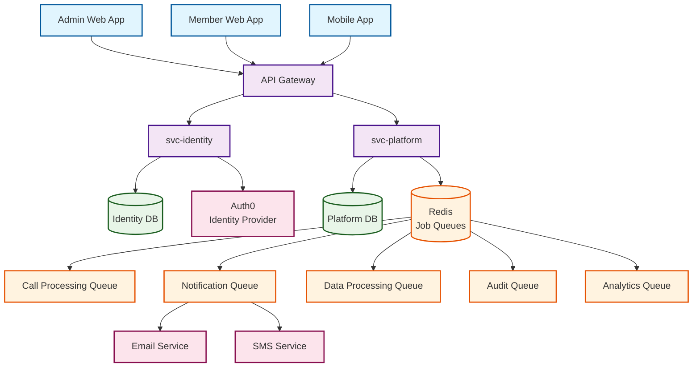

# Services

## Overview

The platform uses a microservices architecture with two core services handling different aspects of the business logic.

## Architecture Diagram



## Core Services

### svc-identity

**Purpose**: Authentication and authorization service

**Technology**: NestJS

**Backend**: Auth0 or similar identity provider

**Capabilities**:

- Issue JWT user access tokens
- Issue API tokens (scoped machine-to-machine)
- User authentication and session management
- Role-based access control

**Endpoints**:

- `/auth/login` - User authentication
- `/auth/refresh` - Token refresh
- `/auth/validate` - Token validation
- `/tokens/issue` - API token issuance

### svc-platform

**Purpose**: Core business logic and data management

**Technology**: NestJS

**Domain**: Members, specialists, call records, insurance plans, metadata

**API Structure**:

- **CRUD Endpoints**: `api.meetmae.com/api/v1/*`
- **Composite Endpoints**: `api.api.meetmae.com/*`

**Key Entities**:

- Members (PHI - requires encryption and audit logging)
- Specialists (PII - requires encryption)
- Call Records (PHI - requires encryption and audit logging)
- Risk Flags (PHI - requires encryption and audit logging)
- Insurance Plans (PHI - requires encryption and audit logging)
- Metadata (Business data - standard security)

_PHI: Protected Health Information_

_PII: Personally Indentifiable Information_

## Service Communication

- **Protocol**: REST APIs
- **Authentication**: JWT tokens for user requests, API tokens for service-to-service
- **Data Format**: JSON
- **Error Handling**: Standardized error responses
- **PHI Handling**: Encrypted transmission of Protected Health Information
- **Audit Logging**: All PHI access logged with user context and timestamp

## Service Endpoints

### svc-identity Endpoints

#### Authentication

```
POST   /auth/login              # User login
POST   /auth/logout             # User logout
POST   /auth/refresh            # Refresh access token
POST   /auth/forgot-password    # Password reset request
POST   /auth/reset-password     # Password reset confirmation
```

#### Token Management

```
POST   /tokens/issue            # Issue API token (M2M)
POST   /tokens/revoke           # Revoke token
GET    /tokens/validate         # Validate token
GET    /tokens/list             # List user tokens
```

#### User Management

```
GET    /users/profile           # Get current user profile
PUT    /users/profile           # Update user profile
GET    /users                   # List users (admin)
POST   /users                   # Create user (admin)
GET    /users/:id               # Get user by ID (admin)
PUT    /users/:id               # Update user (admin)
DELETE /users/:id               # Delete user (admin)
```

#### Role Management

```
GET    /roles                   # List roles
POST   /roles                   # Create role (admin)
GET    /roles/:id               # Get role details
PUT    /roles/:id               # Update role (admin)
DELETE /roles/:id               # Delete role (admin)
```

### svc-platform Endpoints

#### Members

```
GET    /api/v1/members          # List members (with pagination)
POST   /api/v1/members          # Create member
GET    /api/v1/members/:id      # Get member details
PUT    /api/v1/members/:id      # Update member
DELETE /api/v1/members/:id      # Delete member (soft delete)
GET    /api/v1/members/:id/calls # Get member call history
```

#### Specialists

```
GET    /api/v1/specialists      # List specialists
POST   /api/v1/specialists      # Create specialist
GET    /api/v1/specialists/:id  # Get specialist details
PUT    /api/v1/specialists/:id  # Update specialist
DELETE /api/v1/specialists/:id  # Delete specialist
```

#### Call Records

```
GET    /api/v1/calls            # List call records
POST   /api/v1/calls            # Create call record
GET    /api/v1/calls/:id        # Get call details
PUT    /api/v1/calls/:id        # Update call record
DELETE /api/v1/calls/:id        # Delete call record
POST   /api/v1/calls/:id/notes  # Add call notes
GET    /api/v1/calls/scheduled  # Get scheduled calls
```

#### Risk Flags

```
GET    /api/v1/risk-flags       # List risk flags
POST   /api/v1/risk-flags       # Create risk flag
GET    /api/v1/risk-flags/:id   # Get risk flag details
PUT    /api/v1/risk-flags/:id   # Update risk flag
DELETE /api/v1/risk-flags/:id   # Delete risk flag
GET    /api/v1/risk-flags/member/:memberId # Get member risk flags
```

#### Insurance Plans

```
GET    /api/v1/plans            # List insurance plans
POST   /api/v1/plans            # Create plan
GET    /api/v1/plans/:id        # Get plan details
PUT    /api/v1/plans/:id        # Update plan
DELETE /api/v1/plans/:id        # Delete plan
GET    /api/v1/plans/:id/members # Get plan members
```

#### Composite Endpoints

```
GET    /api/dashboard/overview  # Dashboard summary data
GET    /api/dashboard/calls     # Call analytics
GET    /api/dashboard/members   # Member statistics
GET    /api/reports/calls       # Call reports
GET    /api/reports/members     # Member reports
POST   /api/bulk/members        # Bulk member operations
POST   /api/bulk/calls          # Bulk call operations
```

#### Search & Analytics

```
GET    /api/search/members      # Search members
GET    /api/search/specialists  # Search specialists
GET    /api/analytics/calls     # Call analytics
GET    /api/analytics/members   # Member analytics
GET    /api/analytics/performance # Performance metrics
GET    /api/analytics/risk-flags # Risk flag analytics
```

#### Risk Management

```
GET    /api/risk/dashboard      # Risk dashboard overview
GET    /api/risk/trends         # Risk trend analysis
GET    /api/risk/reports        # Risk reports
```

## Future Services

Additional services may be added as the platform grows:

- Notification service
- Analytics service
- File storage service
- Integration service
